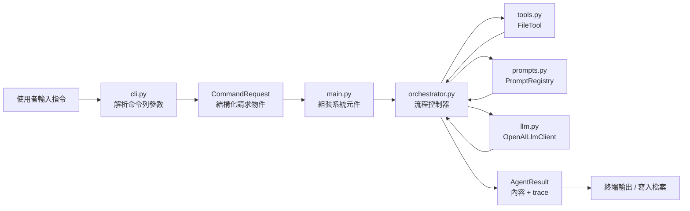
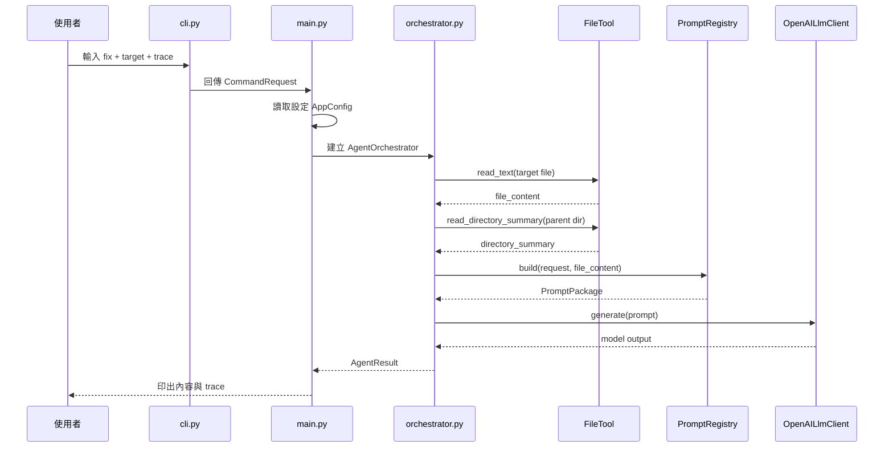
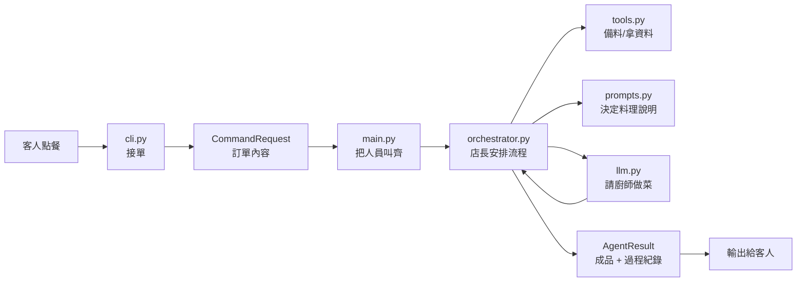
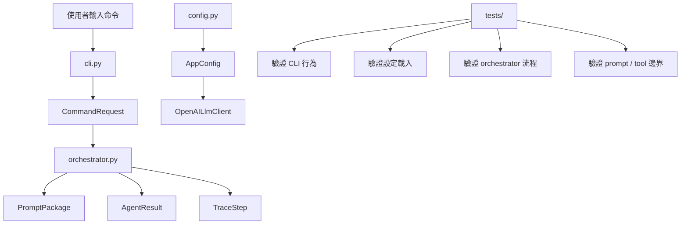

# DevAgent 架構導讀

這份文件的目標不是解釋每一行程式碼，而是幫你建立這個專案的整體理解。

重點是先回答：

- 這個專案整體怎麼運作？
- 每個模組分別負責什麼？
- 為什麼它不是單純的 prompt wrapper？
- 之後如果要自己改功能，該先從哪裡理解？

---

## 1. 專案一句話定位

DevAgent 是一個 **analysis-first、lightweight developer agent CLI**。

它的核心流程是：

`CLI -> Orchestrator -> Tools -> LLM -> Output`

這代表它不是單純把 prompt 丟進模型，而是先透過 CLI 接收命令，再由 orchestrator 控制流程，透過 tool layer 提供受控能力，最後才呼叫 LLM 並輸出結果。

---

## 2. 整體架構圖



---

## 3. 執行流程圖

假設執行這條指令：

```powershell
python -m dev_agent_cli.main fix .\test_cases\inputs\sample_service.py --trace
```

實際流程如下：



---

## 4. 每個模組的責任

| 模組 | 主要責任 | 不該做的事 |
|---|---|---|
| `cli.py` | 解析命令列輸入 | 不該讀檔或打模型 |
| `main.py` | 組裝系統與啟動流程 | 不該承擔業務邏輯 |
| `orchestrator.py` | 控制整個 AI workflow | 不該自己硬寫 prompt 細節 |
| `tools.py` | 提供受控工具能力 | 不該變成萬能 shell |
| `prompts.py` | 產生 command-specific prompt | 不該控制流程 |
| `llm.py` | 呼叫模型 API | 不該知道業務邏輯 |
| `models.py` | 定義共享資料結構 | 不該承擔流程邏輯 |

---

## 5. `main.py` 的角色

`main.py` 的角色很像應用程式的啟動點或 composition root。

它主要做這幾件事：

1. 呼叫 `parse_request()`，把 CLI 輸入轉成 `CommandRequest`
2. 讀取 `.env` 或環境變數設定
3. 建立 `FileTool`、`PromptRegistry`、`OpenAILlmClient`
4. 組裝 `AgentOrchestrator`
5. 執行 `orchestrator.run(request)`
6. 印出結果與 trace

它的重點不是做業務邏輯，而是把整個系統「接起來」。

---

## 6. `cli.py` 的角色

`cli.py` 的責任是把命令列輸入轉成乾淨的 request model。

目前它支援三個 command：

- `explain`
- `fix`
- `gen-api`

並且把這些參數：

- `target`
- `goal`
- `output`
- `trace`

整理成 `CommandRequest`。

這樣後面的 orchestrator 就不用知道 argparse 細節，只需要處理一個穩定的 request 物件。

---

## 7. `orchestrator.py` 的角色

`orchestrator.py` 是這個專案的流程控制器。

一句話：

> 它決定先做什麼、再做什麼、結果怎麼整理。

目前 `run()` 的流程是：

1. 讀取目標檔案內容
2. 讀取目標目錄摘要
3. 根據 command 建 prompt
4. 呼叫 LLM
5. 必要時寫入輸出檔案
6. 收集 trace / telemetry
7. 回傳 `AgentResult`

這是目前整個專案最核心的地方。

---

## 8. `prompts.py` 的角色

`PromptRegistry` 的價值不是單純存放 prompt 字串，而是把不同 command 的 AI 行為明確化。

目前的 mapping 很清楚：

- `explain` -> explain prompt
- `fix` -> fix prompt
- `gen-api` -> gen-api prompt

這就是 command abstraction。

### 為什麼它重要？

因為這樣：

- prompt 不會散在各處
- 每個 command 的行為規格更清楚
- prompt 可以版本化，例如 `fix_v3_structured_markdown`
- 更容易測試與調整

### `fix` 為什麼最像工具？

因為它不是自由回答，而是要求模型固定輸出：

- `Problem Summary`
- `Root Cause`
- `Recommended Fix`
- `Revised Code`
- `Follow-up Checks`

這讓它更像工具輸出，而不是一篇很會寫的 AI 建議文。

---

## 9. `tools.py` 的角色

`FileTool` 是這個專案目前的 tool layer。

它的設計重點不是很強，而是：

- 受控
- 可預測
- 有邊界

目前提供的能力有：

- `read_text()`
- `write_text()`
- `list_files()`
- `read_directory_summary()`

### 為什麼 tool layer 很重要？

如果沒有 tool layer，整個專案會退化成：

- 直接把檔案內容塞進 prompt
- 讓模型自己猜更多 context

有了 tool layer 之後，AI 的上下文來源就變成工程上可控制的資料，而不是純 prompt 猜測。

### 為什麼目前不直接加 shell execution？

因為這個專案目前是 MVP，而且是學習型、作品集導向。

先從 bounded file tools 開始比較合理，因為：

- 安全性高
- 可觀測性高
- 容易說明設計理由
- 風險比 shell execution 低很多

---

## 10. `llm.py` 的角色

`llm.py` 負責封裝模型呼叫。

它做的事情很單純：

- 接收 `PromptPackage`
- 呼叫 OpenAI Responses API
- 回傳模型輸出文字

它不負責：

- 決定流程
- 讀檔
- 組 prompt
- 理解業務邏輯

它只是模型呼叫的 adapter。

---

## 11. `models.py` 的角色

`models.py` 提供整個專案共享的資料結構，例如：

- `CommandRequest`
- `PromptPackage`
- `TraceStep`
- `AgentResult`

你可以把它想成：

> 讓不同模組之間講同一種語言。

這樣 CLI、orchestrator、prompt registry、LLM client 就不用彼此直接吃很原始的資料格式。

---

## 12. 為什麼這個專案不是單純 prompt wrapper？

如果是一般 prompt wrapper，流程通常是：

```text
讀檔 -> 拼 prompt -> 丟模型 -> 拿回答
```

但 DevAgent 目前已經多了這些關鍵元素：

- command abstraction
- orchestrator-controlled workflow
- tool layer
- repo-aware context
- structured output
- trace / telemetry

所以更準確的說法是：

> 這是一個 analysis-first、lightweight developer agent harness，而不是只有 prompt in / answer out 的小工具。

---

## 13. 用餐廳比喻來理解

如果你覺得模組之間很抽象，可以用餐廳來想：



對應關係：

- `cli.py` = 櫃檯
- `main.py` = 開店 / 接線
- `orchestrator.py` = 店長
- `tools.py` = 備料區
- `prompts.py` = 菜單規格
- `llm.py` = 廚師
- `trace` = 廚房作業紀錄

---

## 14. 你目前最該會講的 5 句話

1. 這個專案是 analysis-first 的 developer agent CLI。
2. 它的核心流程是 `CLI -> Orchestrator -> Tools -> LLM -> Output`。
3. `Orchestrator` 的責任是控制流程，不是做所有事情。
4. `PromptRegistry` 讓不同 command 有明確的 prompt abstraction。
5. `FileTool` 目前刻意保持安全，只提供 bounded file operations。

如果這 5 句你能自然講出來，代表你對整個專案已經有不錯的理解。

---

## 15. 建議學習順序

如果你要持續把這個專案真正內化，建議順序是：

### 第一輪：先懂流程

- `main.py`
- `cli.py`
- `orchestrator.py`

### 第二輪：再懂 agent 核心

- `prompts.py`
- `tools.py`

### 第三輪：補工程化支撐

- `models.py`
- `config.py`
- `tests/`

### 第四輪：自己改一個小功能

例如：

- 增加一個 trace 欄位
- 修改 `fix` prompt
- 調整 `list_files()` 的行為

---

## 16. 目前理解自己的檢查題

你可以用下面 3 題檢查自己：

1. 如果拿掉 `orchestrator.py`，整個專案會變成什麼樣子？
2. 如果拿掉 `tools.py`，這個專案會退化成什麼？
3. `PromptRegistry` 和 `llm.py` 最大差別是什麼？

如果你能用自己的話回答出來，而且答案越來越穩，代表你開始真的理解這個專案，而不是只會看檔名。

---

## 17. 第三輪：工程化支撐層

第三輪的重點不是流程本身，而是回答：

> 這個專案為什麼開始像一個工程專案，而不只是能跑的 demo？

答案主要在三塊：

- `models.py`
- `config.py`
- `tests/`

你可以把這一層想成：

- `models.py`：讓模組之間有共同語言
- `config.py`：讓程式能在不同環境穩定啟動
- `tests/`：讓你敢改東西，而且知道現在沒壞

### 17.1 工程化支撐圖



---

## 18. `models.py`：系統的共同語言

`models.py` 的核心價值不是功能很多，而是：

> 讓不同模組之間講同一種語言。

如果沒有這層，很容易變成：

- CLI 回傳一種格式
- Orchestrator 吃另一種格式
- PromptRegistry 再吃另一種格式
- Trace 又是自由格式

最後每個模組都在猜彼此的資料長什麼樣。

### 18.1 `CommandRequest`

```python
@dataclass(slots=True)
class CommandRequest:
    command: CommandName
    target_path: Path
    goal: str | None = None
    output_path: Path | None = None
    trace: bool = False
```

它代表：

> 使用者這次到底想做什麼。

它是整個工作流的輸入模型，類似 backend 裡的 request DTO / command object。

### 18.2 `PromptPackage`

```python
@dataclass(slots=True)
class PromptPackage:
    template_name: str
    system_prompt: str
    user_prompt: str
```

它代表：

> prompt 不是隨便拼的一大段字串，而是一個正式的結構化資料。

它的工程價值：

- 可以知道用了哪個 template
- 可以 trace
- 可以版本化
- 可以測試 prompt 結構

### 18.3 `TraceStep`

```python
@dataclass(slots=True)
class TraceStep:
    stage: str
    action: str
    observation: str
    details: dict[str, str] = field(default_factory=dict)
```

它代表：

> trace 不是幾行 print，而是一個有欄位的觀測事件。

所以之後如果要：

- 改成 JSON
- 存成檔案
- 做 UI 顯示

都會比較容易。

### 18.4 `AgentResult`

```python
@dataclass(slots=True)
class AgentResult:
    command: CommandName
    target_path: Path
    content: str
    trace_steps: list[TraceStep] = field(default_factory=list)
```

它代表：

> Orchestrator 回傳的不是裸字串，而是一個正式結果物件。

這讓 `main.py` 不只知道輸出內容，還知道：

- command 是什麼
- target 是哪個檔案
- trace 有哪些步驟

### 18.5 `models.py` 的一句話總結

> `models.py` 讓各模組之間用穩定資料結構互動，而不是散亂地傳字串或 dict。

---

## 19. `config.py`：讓程式能穩定啟動

`config.py` 的重點不是炫技，而是處理真實開發問題：

- API key 放哪裡？
- 本地和部署環境怎麼共存？
- 缺設定時要怎麼提示？

### 19.1 `ConfigError`

```python
class ConfigError(ValueError):
    """Raised when required application configuration is missing."""
```

這表示：

- 設定錯誤被當成一種正式錯誤類型
- 而不是隨便丟一個 generic exception

### 19.2 `_parse_dotenv()`

這個函式負責：

- 讀 `.env`
- 忽略空行與註解
- 將 `KEY=VALUE` 解析成字典

這樣 `.env` 的處理邏輯就不會散落在各個檔案。

### 19.3 `AppConfig`

```python
@dataclass(slots=True)
class AppConfig:
    openai_api_key: str
    openai_model: str = "gpt-4.1-mini"
```

它代表：

> 程式真正需要的設定集合。

這跟 `CommandRequest` 很像：

- `CommandRequest` 整理使用者意圖
- `AppConfig` 整理執行環境設定

### 19.4 `from_env()` 的優先順序

目前的設計是：

```text
runtime environment -> .env -> default
```

也就是：

1. 真正環境變數優先
2. `.env` 次之
3. 最後才用預設值

這個設計的好處：

- 本地開發方便
- 部署也不被 `.env` 綁死
- 開源專案的體驗比較好

### 19.5 `config.py` 的一句話總結

> `config.py` 把環境設定變成正式系統元件，而不是讓專案只在某台機器上剛好能跑。

---

## 20. `tests/`：讓你敢改東西

對這種 developer tooling / agent CLI 專案來說，測試很重要，因為它不是單純頁面或 CRUD：

- prompt 會改
- trace 會改
- config 會改
- tool 行為會改

如果沒有測試，之後每次調 prompt 或改 trace 都很容易不小心壞掉。

### 20.1 `tests/test_cli.py`

這個檔案主要測：

- CLI parsing
- `.env` 載入
- 環境變數覆蓋 `.env`
- 缺少 API key 時的友善錯誤訊息
- `main()` 在設定缺失時能否乾淨退出

它在驗證的是：

> 使用者輸入與執行環境設定，能不能穩定地轉成系統可用狀態。

### 20.2 `tests/test_orchestrator.py`

這個檔案主要測：

- orchestrator 基本流程
- trace 欄位是否存在
- `fix` prompt heading 是否穩定
- `FileTool` 的 directory summary 行為
- `list_files()` 的 extension filter / depth limit

它在驗證的是：

> 這個專案最重要的流程邊界和工具邊界，有沒有按照預期工作。

### 20.3 為什麼 tests 代表工程化？

因為它代表你不只是想讓專案今天跑成功一次，而是希望它能：

- 安全演進
- 容易重構
- 修改後可以快速驗證

### 20.4 `tests/` 的一句話總結

> `tests/` 讓這個專案不只是 demo，而是可以持續演進的工程作品。

---

## 21. 這一輪最重要的 3 件事

### 21.1 `models.py`

讓模組之間有共同語言，而不是散亂傳資料。

### 21.2 `config.py`

讓專案能在不同環境下穩定啟動，而不是只在你電腦上剛好能跑。

### 21.3 `tests/`

讓你敢改東西，而且改完知道有沒有壞。

---

## 22. 三輪合起來後，這個專案為什麼比較像工程系統？

### 第一輪

- 有清楚流程控制
- 有 orchestrator

### 第二輪

- 有 command abstraction
- 有 tool layer
- 有 bounded repo-aware context

### 第三輪

- 有正式資料模型
- 有設定管理
- 有單元測試

所以現在它比較像：

> 一個有邊界、有流程、有資料結構、有設定管理、有測試保護的輕量工程系統。

---

## 23. 第三輪的短版講法

你之後可以用這段話來描述這一層：

- `models.py` 定義系統內部共用的資料結構，讓模組之間互動更穩定。
- `config.py` 處理 `.env` 和環境變數讀取，讓專案本地開發和部署情境都比較好管理。
- `tests/` 驗證 CLI、config、orchestrator、prompt 結構和 file tools，讓這個專案可以持續演進，而不是只靠手動測試。

---

## 24. 第三輪檢查題

你可以用下面 3 題檢查自己：

1. 為什麼 `PromptPackage` 和 `AgentResult` 這種 model 對這個專案有價值？
2. 為什麼 `.env` + 環境變數覆蓋的設計，比只支援其中一種更好？
3. 為什麼這個專案要測 `fix` 的 heading 結構，而不是只測它有沒有輸出文字？

如果你能用自己的話回答出來，而且答案越來越穩，代表你已經從「看得懂 code」進到「開始理解設計」。
