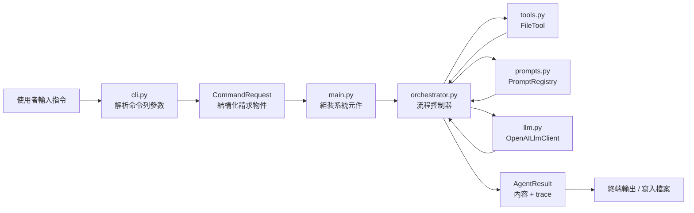
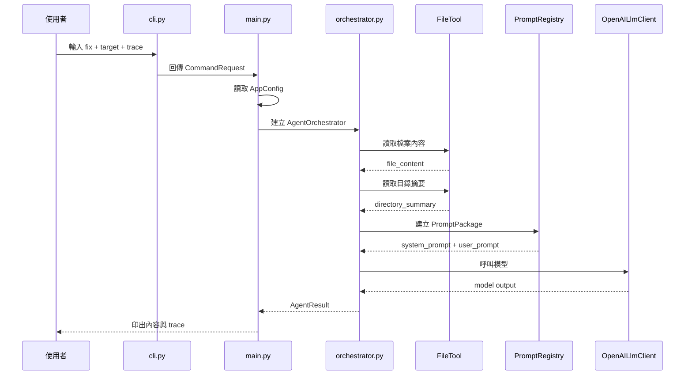

# DevAgent Architecture Overview

這份文件是給第一次接觸 DevAgent 的讀者看的。

目標不是解釋所有程式細節，而是讓人快速理解：

- 這個專案是什麼
- 核心流程怎麼跑
- 主要模組如何分工
- 為什麼它不是單純的 prompt wrapper

---

## 1. 專案定位

DevAgent 是一個 **analysis-first、lightweight developer agent CLI**。

它的核心流程是：

`CLI -> Orchestrator -> Tools -> LLM -> Output`

目前支援三個 command：

- `explain`
- `fix`
- `gen-api`

它的重點不是做成全自動 agent，而是先把 developer tooling 的基本骨架做清楚：

- command abstraction
- orchestrator-controlled workflow
- safe file tools
- structured output
- trace / telemetry

---

## 2. 整體架構圖



---

## 3. 一次請求的執行流程

以這條指令為例：

```powershell
python -m dev_agent_cli.main fix .\test_cases\inputs\sample_service.py --trace
```

流程如下：



---

## 4. 主要模組分工

| 模組 | 主要責任 |
|---|---|
| `cli.py` | 解析命令列輸入，轉成 `CommandRequest` |
| `main.py` | 組裝系統元件，啟動流程，處理最外層輸出與錯誤 |
| `orchestrator.py` | 控制整個 AI workflow，協調 tools、prompts、LLM |
| `tools.py` | 提供安全且有邊界的檔案與目錄操作能力 |
| `prompts.py` | 依 command 建立對應的 prompt template |
| `llm.py` | 封裝 OpenAI API 呼叫 |
| `models.py` | 定義模組間共用的資料結構 |
| `config.py` | 處理 `.env` 與環境變數設定 |

---

## 5. 為什麼這個專案不是單純 prompt wrapper？

如果是一般 prompt wrapper，流程通常是：

```text
讀檔 -> 拼 prompt -> 丟模型 -> 拿回答
```

DevAgent 則多了幾層明確的工程邊界：

- `CLI`：先把使用者輸入整理成正式 request
- `Orchestrator`：由流程控制器安排順序
- `Tools`：由受控工具提供上下文，而不是讓模型純猜
- `PromptRegistry`：每個 command 有自己的 prompt abstraction
- `TraceStep`：保留執行過程的觀測資訊

因此更精確的說法是：

> DevAgent 是一個輕量、可控、偏分析型的 developer agent harness。

---

## 6. 目前的設計取向

這個專案目前刻意保持輕量，不追求一次做成完整 agent 平台。

### 已經有的能力

- 單檔分析
- 輕量 repo-aware context
- 結構化 `fix` 輸出
- trace / telemetry
- `.env` 設定管理

### 刻意還沒做的能力

- shell execution
- patch apply engine
- autonomous multi-step loop
- vector DB / RAG

這樣的取向比較符合 MVP，也更容易作為學習型和作品集導向的專案。

---

## 7. 如果第一次閱讀原始碼，建議先看哪裡？

建議順序：

1. `src/dev_agent_cli/main.py`
2. `src/dev_agent_cli/cli.py`
3. `src/dev_agent_cli/orchestrator.py`
4. `src/dev_agent_cli/prompts.py`
5. `src/dev_agent_cli/tools.py`
6. `src/dev_agent_cli/models.py`
7. `src/dev_agent_cli/config.py`
8. `tests/`

---

## 8. 相關文件

- 詳細學習版導讀：`docs/architecture_study_guide.md`
- 原始完整筆記：`docs/architecture_guide.md`

