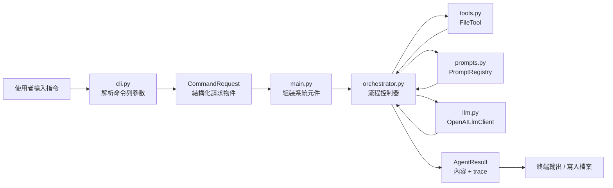
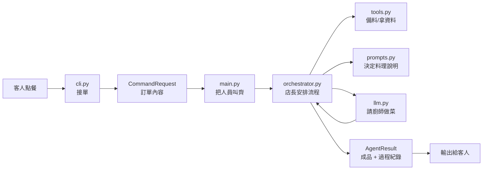

# DevAgent Architecture Study Guide

這份文件是學習版導讀，目的不是只讓你知道檔案名稱，而是幫你把整個系統「串起來」。

它比較適合：

- 自己複習架構
- 準備面試講法
- 帶著問題去讀原始碼
- 對這個專案有興趣，想更深入理解的人

如果你只想先快速理解系統，請先看 `docs/architecture_overview.md`。

---

## 1. 先建立一個總 mental model

這個專案不是聊天機器人，而是：

> 一個把使用者意圖轉成受控 AI workflow 的輕量 developer agent CLI。

你可以先把主要模組記成這樣：

- `cli.py`：接收命令列輸入
- `main.py`：組裝系統
- `orchestrator.py`：控制流程
- `tools.py`：提供受控能力
- `prompts.py`：決定不同 command 怎麼問模型
- `llm.py`：真的去呼叫模型
- `models.py`：提供模組之間共用的資料結構
- `config.py`：處理 `.env` 與環境設定
- `tests/`：保護核心行為

---

## 2. 先看整體流程，再看細節



一句話版：

> CLI 先把輸入整理成 request，`main.py` 把系統接起來，`orchestrator.py` 再決定整個 AI workflow 怎麼跑。

---

## 3. 第一輪：只看流程層

這一輪先看：

- `main.py`
- `cli.py`
- `orchestrator.py`

### 3.1 `main.py`

`main.py` 很像應用程式的 composition root。

它的責任：

1. 把 CLI 輸入轉成 `CommandRequest`
2. 讀設定
3. 建立 `FileTool`、`PromptRegistry`、`OpenAILlmClient`
4. 組裝 `AgentOrchestrator`
5. 執行 `orchestrator.run(request)`
6. 印出結果與 trace

關鍵理解：

> `main.py` 不自己讀檔、組 prompt、打模型，它只負責把系統接起來。

### 3.2 `cli.py`

`cli.py` 的責任是把命令列輸入轉成乾淨的 request model。

目前支援：

- `explain`
- `fix`
- `gen-api`

它最後會產生一個 `CommandRequest`，讓後面的 orchestrator 不需要知道 argparse 細節。

關鍵理解：

> `cli.py` 是把「人類輸入」翻譯成「系統內部格式」。

### 3.3 `orchestrator.py`

`orchestrator.py` 是這個專案的流程大腦。

它決定：

1. 先讀檔
2. 再讀目錄摘要
3. 再建 prompt
4. 再呼叫 LLM
5. 再決定要不要寫檔
6. 最後組裝 trace 與結果

關鍵理解：

> `Orchestrator` 決定流程怎麼跑，而不是自己承擔所有細節。

---

## 4. 第二輪：理解 agent 的核心味道

這一輪先看：

- `prompts.py`
- `tools.py`

### 4.1 `PromptRegistry`

`PromptRegistry` 的價值不是單純存 prompt，而是：

> 管理 command-specific AI behavior。

這裡真正重要的是 command abstraction：

- `explain` 有自己的 prompt
- `fix` 有自己的 prompt
- `gen-api` 有自己的 prompt

這代表不同 command 不只是名字不同，而是：

- 任務目標不同
- 輸出期待不同
- 限制條件不同

### 4.2 為什麼 `fix` 最像工具？

因為 `fix` 不是自由回答，而是要求穩定輸出：

- `Problem Summary`
- `Root Cause`
- `Recommended Fix`
- `Revised Code`
- `Follow-up Checks`

這代表它開始從「會講話的建議文」走向「可消費的工具輸出」。

### 4.3 `FileTool`

`FileTool` 是目前的 tool layer。

目前能力有：

- `read_text()`
- `write_text()`
- `list_files()`
- `read_directory_summary()`

它的重點不是很強，而是：

- 受控
- 可預測
- 有邊界

這也是為什麼目前不直接加 shell execution。

關鍵理解：

> tool layer 讓 AI 的上下文來自工程上可控制的資料，而不是純 prompt 猜測。

---

## 5. 第三輪：工程化支撐層

這一輪先看：

- `models.py`
- `config.py`
- `tests/`

### 5.1 `models.py`

`models.py` 的價值是：

> 讓不同模組之間講同一種語言。

主要 model：

- `CommandRequest`
- `PromptPackage`
- `TraceStep`
- `AgentResult`

如果沒有這層，很容易變成：

- 每個模組都在傳散亂的 dict / string
- 很難維護
- 很難測

### 5.2 `config.py`

`config.py` 解的是實際工程問題：

- API key 放哪裡？
- 本地與部署如何共存？
- 缺設定時怎麼提示？

目前設計大致是：

```text
runtime environment -> .env -> default
```

也就是：

1. 環境變數優先
2. `.env` 次之
3. 最後才使用預設值

### 5.3 `tests/`

`tests/` 的價值不是「有測試比較正式」，而是：

> 讓你敢改東西，而且改完知道有沒有壞。

目前主要驗證：

- CLI parsing
- `.env` 載入與覆蓋
- orchestrator 流程
- `fix` heading 結構
- repo-aware file tool 行為

---

## 6. 用 backend 比喻來理解

如果你是用 backend 分層角度看，這個專案可以這樣對應：

| DevAgent 模組 | 類比到 backend |
|---|---|
| `cli.py` | Controller / API input parsing |
| `main.py` | Program.cs / composition root |
| `orchestrator.py` | Application service / use case coordinator |
| `tools.py` | Infrastructure service / bounded dependency |
| `prompts.py` | Task-specific policy / request builder |
| `llm.py` | External API client |
| `models.py` | DTO / command / response models |
| `config.py` | app settings / environment binding |
| `tests/` | regression safety net |

這個對照很重要，因為它能把你熟悉的 backend 思維接到 AI tooling 上。

---

## 7. 為什麼這個專案不是 prompt wrapper？

因為它不是單純做這件事：

```text
讀檔 -> 拼一大段 prompt -> 丟模型 -> 印回答
```

它多了幾個很關鍵的工程邊界：

- `CommandRequest`：先把輸入正式化
- `Orchestrator`：由流程控制器安排工作流
- `FileTool`：由工具層提供受控上下文
- `PromptRegistry`：以 command 為中心管理 prompt
- `TraceStep`：保留執行過程與觀測資訊

因此更準確的定位是：

> 一個 analysis-first、lightweight developer agent harness。

---

## 8. 用餐廳比喻再記一次



對應關係：

- `cli.py` = 櫃檯
- `main.py` = 開店 / 接線
- `orchestrator.py` = 店長
- `tools.py` = 備料區
- `prompts.py` = 菜單規格
- `llm.py` = 廚師
- `trace` = 廚房作業紀錄

---

## 9. 你目前最該會講的 5 句話

1. 這個專案是 analysis-first 的 developer agent CLI。
2. 它的核心流程是 `CLI -> Orchestrator -> Tools -> LLM -> Output`。
3. `Orchestrator` 的責任是控制流程，不是做所有事情。
4. `PromptRegistry` 讓不同 command 有明確的 prompt abstraction。
5. `FileTool` 目前刻意保持安全，只提供 bounded file operations。

---

## 10. 建議學習順序

如果你要持續把這個專案真正內化，建議順序是：

### 第一輪：先懂流程

- `main.py`
- `cli.py`
- `orchestrator.py`

### 第二輪：再懂 agent 核心

- `prompts.py`
- `tools.py`

### 第三輪：補工程化支撐

- `models.py`
- `config.py`
- `tests/`

### 第四輪：自己改一個小功能

例如：

- 增加一個 trace 欄位
- 修改 `fix` prompt
- 調整 `list_files()` 的 filter 行為

---

## 11. 自我檢查題

### 流程層

1. 為什麼 `main.py` 不直接自己讀檔、組 prompt、打模型？
2. 為什麼 `cli.py` 不直接把 argparse 的 `args` 往後傳？
3. `Orchestrator` 和 `PromptRegistry` 的責任差在哪裡？

### agent 核心層

1. 為什麼 `PromptRegistry` 比把 prompt 直接寫在 orchestrator 裡更好？
2. 為什麼 `FileTool` 的 bounded 設計，比直接加 shell execution 更適合現在這個 MVP？
3. 為什麼 `fix` 的固定 heading，會讓它更像工具而不是一般 AI 回答？

### 工程化支撐層

1. 為什麼 `PromptPackage` 和 `AgentResult` 對這個專案有價值？
2. 為什麼 `.env` + 環境變數覆蓋的設計，比只支援其中一種更好？
3. 為什麼這個專案要測 `fix` 的 heading 結構，而不是只測它有沒有輸出文字？

---

## 12. 最後的記憶法

如果你現在只想先記住最精簡的版本，記下面這段就好：

> DevAgent 是一個 analysis-first 的 developer agent CLI。  
> `cli.py` 接收命令，`main.py` 組裝系統，`orchestrator.py` 控制流程，`tools.py` 提供受控能力，`prompts.py` 管理不同 command 的 prompt，`llm.py` 封裝模型呼叫，`models.py` 定義共同資料結構，`config.py` 負責環境設定，`tests/` 則讓整個專案能安全演進。

---

## 13. 相關文件

- 對外導讀版：`docs/architecture_overview.md`
- 原始完整筆記：`docs/architecture_guide.md`

